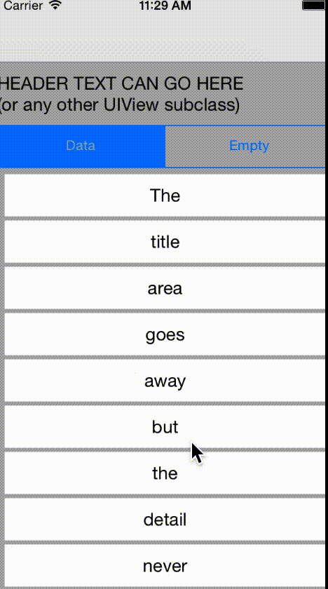
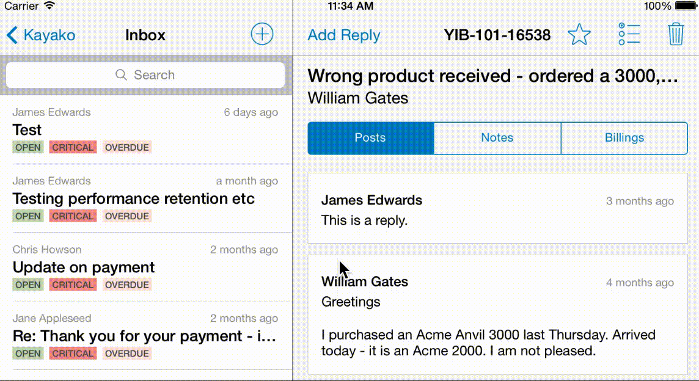

# BMFloatingHeaderCollectionViewLayout

## Usage

I can't find the words to describe what this does at the moment. I'm not feeling very eloquent today. So refer to the pretty moving pictures for details.

In short, this UICollectionViewLayout subclass (and helper classes) gives you two slots above a collection view proper. One slot is for a header that will slide away on scroll, the other is for a header that will slide to the top of the screen on scroll but no further. These can contain any UIView subclass. 

It is written with performance in mind, handles all orientations and orientation changes and even has a way for you to specify an "empty" view to show when your dataset has no results. All in all, it's pretty handy. I apologise upfront for the ugly demo app but to make up for it, you can see how beautiful it looks in a real app - that's Kayako for iOS (second screenshot).

To run the example project; clone the repo, and run `pod install` from the Example directory first.

## Installation

BMFloatingHeaderCollectionViewLayout is available through [CocoaPods](http://cocoapods.org), to install
it simply add the following line to your Podfile:

    pod "BMFloatingHeaderCollectionViewLayout"

## Author

Adam Iredale, [@iosengineer](https://twitter.com/iosengineer)

## License

BMFloatingHeaderCollectionViewLayout is available under the MIT license. See the LICENSE file for more info.

